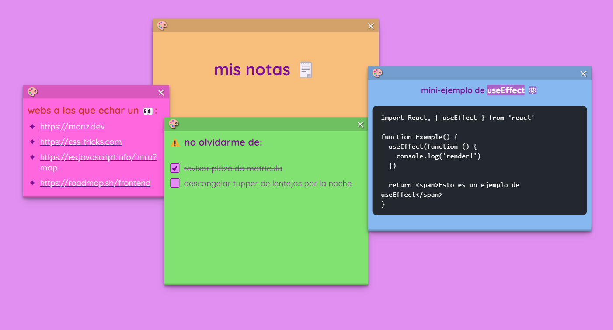

# 🗒️ Mis notas rápidas
_Una app para organizar notas rápidas con cierta posibilidad de personalización, y que se conservarán entre sesiones gracias a su almacenamiento local en el navegador web._

## 🪄 Demo
https://misnotas.vercel.app

## 📋 Requisitos
* A través de la tecnología de React, desmenuzar en componentes todos aquellos elementos que conformarán la web.
* Las notas se podrán arrastrar a lo largo de la ventana, así como modificar ciertos aspectos personalizables como sus colores o sus dimensiones.
* Se conservarán entre sesiones todo lo contenido en la app (posición de las notas, dimensiones, texto enriquecido...) a través del empleo del <code>localStorage</code>.
* El editor de texto de las notas reconocerá la sintaxis Markdown con la finalidad de hacer más sencillo y ágil el proceso de formateo de su contenido (a través de la herramienta de desarrollo <strong><a href="https://tiptap.dev" target="_blank">tiptap</a></strong>).

## 🛠️ Características a arreglar / mejorar
* Revisar gestión de la pila de notas con respecto a sus <code>z-Index</code> correspondientes, de manera que a medida que se interactúen con ellas, éstas se vayan situando por encima de las demás sucesivamente. 
* Revisar la posibilidad de añadir la funcionalidad de adjuntar/arrastrar imágenes al editor de texto.
* ¿Más opciones de personalización?

## 📎Lo utilizado

